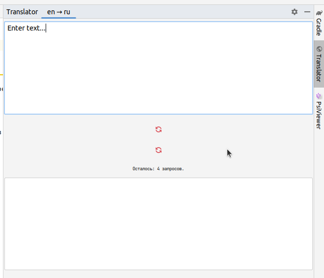
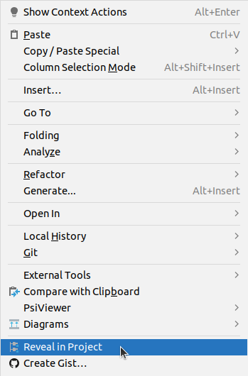
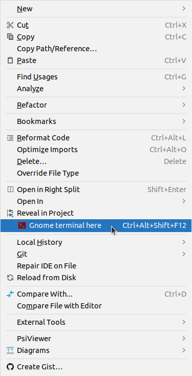

### Набор плагинов для Intellij IDEA

- переводчик (использует бесплатный API с ограничением количества запросов в сутки)

- добавление в контекстное меню пункта (_Reveal in project_) для показа файла в структуре проекта

- добавление в контекстное меню пункта (_Gnome terminal here_) для открытия терминала GNOME в месте расположения файла

- добавление live template для вставки текущих даты и времени
